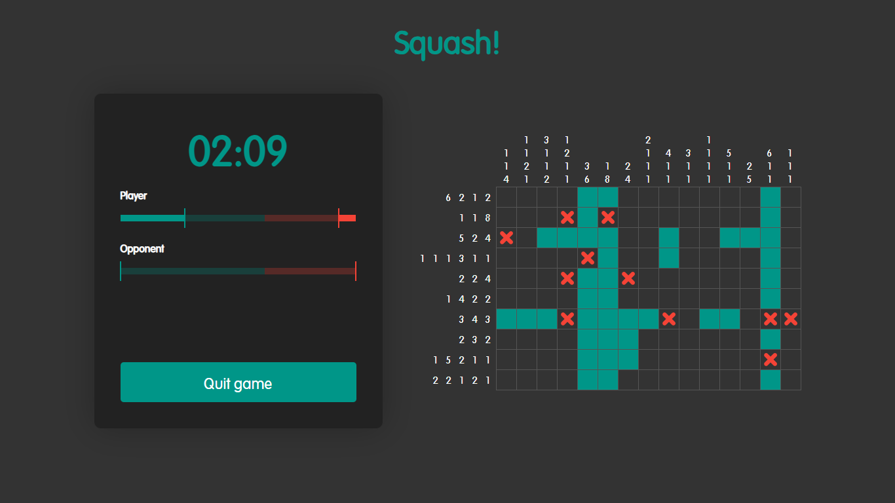

# Squash!

Squash is a multiplayer board game where players solve a numbers riddle by utilizing the given hints. Inspired by [Detective Riddles - Sherlock's Heritage](https://store.steampowered.com/app/1546340/Detective_Riddles__Sherlocks_Heritage/), the game supports multiplayer matches where players battle it on time to correctly fill in all squares on the board.

## Requirements

 - Node.js version 16.0 or later
 - Web browser:
   - Chrome version 80.0 or above
   - Firefox version 68 or above
   - Edge Anaheim or later

## Run locally

**This game is under development.** Follow these steps to test the game in your local machine:
  1. First, you will need a running Pusher channels app, so go and [create one](https://dashboard.pusher.com/channels). You will also need to [create a Pusher account](https://dashboard.pusher.com/accounts/sign_up) before you can create a Pusher app.

  2. When your Pusher app is ready, go to your app's dashboard and select "App Keys" on the left. You will need to configure the client and server with these keys.

     In the `api` folder, open `index.js` in your preferred editor and update the default app keys near the top of the file.

         const APP_ID_DEFAULT = "your_app_id_here"
         const APP_KEY_DEFAULT = "your_app_key_here"
         const APP_SECRET_DEFAULT = "your_app_secret_here"
         const APP_CLUSTER_DEFAULT = "your_app_cluster_here"

     In the `client/src` folder, open `config.json` in your preferred editor and update the `appKey` entry.

         {
           "appKey": "a3fff4c418b83c2b12db",
           ...
         }

  3. cd into the `client` directory, install the required dependencies and build the Vue.js app.

         cd client
         npm install
         npm run build

  4. cd into the `server` directory and install the required dependencies.

         cd ../api
         npm install

  5. Run the game server. It uses port 3000 by default
  
         npm start

  6. Open [`http://localhost:3000`](`http://localhost:3000`) in your browser.

## Contribute

Everything in this repository is open to change, so feel free to contribute any new ideas or enhancements!

To contribute to Squash!, clone this repository and open the source code in your favorite IDE (VS Code is recommended).

## Licenses

Code in this repository is licensed under the [Apache License 2.0](https://www.apache.org/licenses/LICENSE-2.0).
